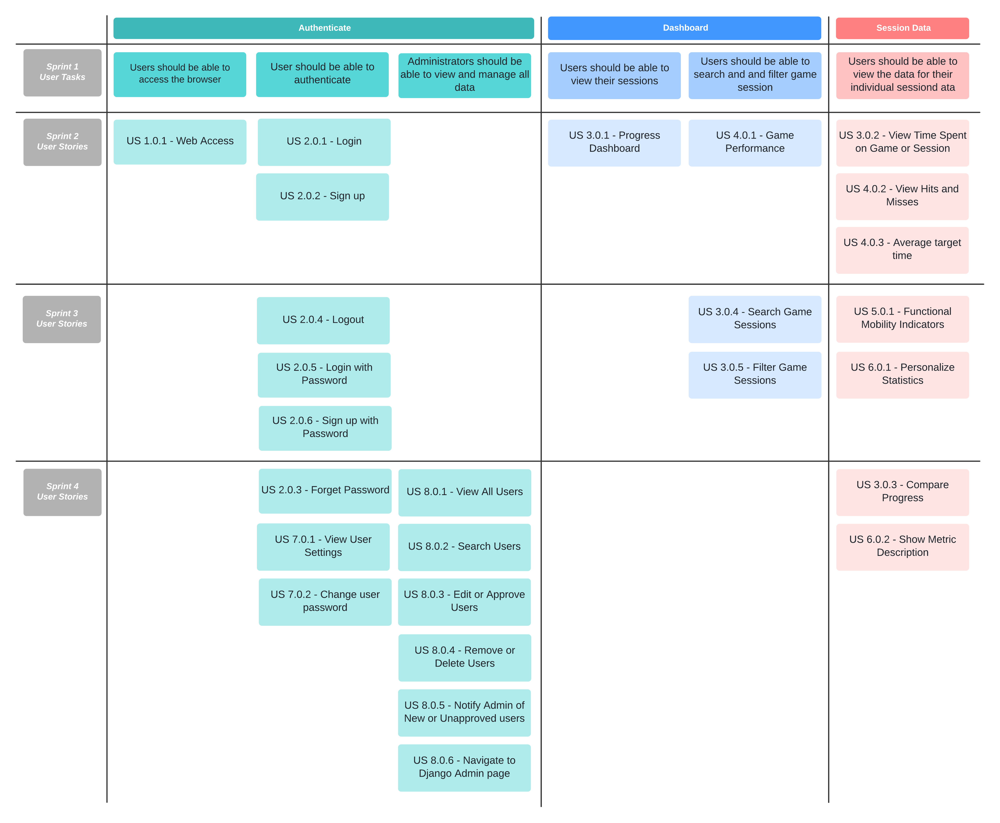
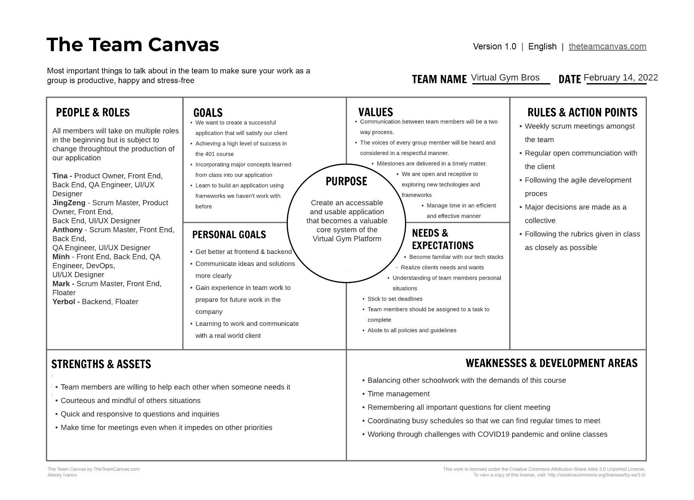

# Project Management

This page provides a general overview of the assigned tasks and roles for the duration of four sprints (subject to change).

## Story Map

## Project Plan
### Sprint 1  
**Due: January 29**

**Product Owner**: JingZeng  
**Scrum Master**: Anthony

| **Rubric Description** | **Task To-Do** | **Assigned To** | **Date To Complete By** |
| --- | --- | --- | --- | 
| Project Summary | Documentation | Tina & Anthony | January 26 |  
| Project Glossary | Documentation | Tina & Anthony | January 27 |
| User Stories | Documentation | Tina & Anthony | January 27 |  
| MoSCoW | Documentation | Tina & Anthony | January 27 |  
| Similar Products | Documentation | Tina & Anthony | January 27 |
| Open-source Projects | Documentation | Tina & Anthony | January 27 |
| Techincal Resources | Documentation | Tina & Anthony | January 27 |  
| Architecture/Component Diagram | Documentation | Minh & Yerbol | January 27 |
| UML Diagram | Documentation | Minh & Yerbol | January 27 |
| Class Diagram | Documentation | Tina & Anthony | January 28 |
| Sequence Diagram | Documentation | Tina & Anthony | January 28 |
| Low-Fidelity UI | Documentation | Minh & Yerbol | January 27 |  
| Story Map | Documentation | JingZeng & Mark | January 28 |
| Project Plan | Documentation | JingZeng & Mark | January 26 |  
| Team Canvas | Documentation | JingZeng & Mark | January 26 |

### Sprint 2  
**Due: February 26**

**Product Owner**: JingZeng  
**Scrum Master**: Anthony

**Milestone**: Easily register and login, then display game session datas to Dashboard

| **Rubric Description** | **Task To-Do** | **Assigned To** | **Date To Complete By** |
| --- | --- | --- | --- | 
| Skeleton Website | Django/Backend Development | Anthony & Minh | February 7 |
| Database Setup | Django/Backend Development | Yerbol & Anthony | February 12 | 
| Django Models | Django/Backend Development | Yerbol & Anthony | February 12 | 
| URL Mapping | Django/Backend Development | JingZeng & Anthony | February 26 | 
| API documentation | Django/Backend Development | JingZeng & Yerbol | February 26 | 
| Implement Feedback from Sprint 1 | Documentation | Anthony, Minh, Tina, Yerbol & JingZeng | February 14 | 
| Web Access/Deployment | US 1.0.1 | JingZeng & Anthony | February 24 | 
| Login | US 2.0.1 | Minh | February 18 | 
| Progress Dashboard | US 3.0.1 | JingZeng, Anthony, Yerbol & Tina | February 16 | 
| Game Performance | US 4.0.1 | Tina | February 18 | 
| View Time Spent on Game or Session | US 3.0.2 | Anthony | February 18 | 
| Search Game Sessions | US 3.0.4 | Yerbol | February 18 | 
| Sign Up | US 2.0.2 | Minh | February 26 | 
| View Hits and Misses | US 4.0.2 | Tina | February 26 | 
| Average Target Time | US 4.0.3 | Tina | February 18 | 
| Merge login and dashboard | Programming | Minh | February 26 | 
| Unit Test of Model | Programming | Anthony | February 24 | 
| Unit Test of API | Programming | Anthony & JingZeng | February 26 | 
| Unit Test of Front-End | Programming | Minh & Tina | February 26 | 
| Test Documentation | Documentation | JingZeng & Anthony | January 26 |  

### Sprint 3  
**Due: March 19**

**Product Owner**: Tina  
**Scrum Master**: Anthony

**Milestone**: A complete account system, session data can be properly parsed and uploaded to our system. Dashboard and Sessions can display all user required datas.

| **Rubric Description** | **Task To-Do** | **Assigned To** | **Date To Complete By** |
| --- | --- | --- | --- | 
| Show/Hide Statistics | US 6.0.1 | Minh, JingZeng, Mark & Tina  | March 17 | 
| Filter Game Sessions - Version | US 3.0.5 | JingZeng & Minh  | March 18 | 
| Filter Game Sessions - Game | US 3.0.5 | JingZeng  | March 13 | 
| Filter Game Sessions - DateRange | US 3.0.5 | JingZeng & Mark | March 16 | 
| Functional Mobility Indicators - AvgJoint | US 5.0.1 | Yerbol | March 19 | 
| Functional Mobility Indicators - IndJoint | US 5.0.1 | Yerbol | March 19 | 
| Address Sprint 2 Feedback | Documentation | Anthony, Minh, JingZeng & Tina | March 3 |
| Make Parser and Analyzer | Activity | Anthony, Tina & Yerbol | March 19 | 
| Analyzer - Hit Miss Metric | Programming | Tina | March 10 |
| Analyzer - Time Spent Metric | Programming | Tina | March 10 |
| Analyzer - Average Target Time Metric | Programming | Anthony | March 12 |
| Analyzer - Joint Speed | Programming | Yerbol | March 12 |
| Analyzer - Space Coverage | Programming | Yerbol | March 13 |
| Separate Admin and Regular User Accounts | Programming | Minh | March 18 | 
| Login using Password | US 2.0.5 | Minh | March 17 | 
| Signup using Password | US 2.0.6 | Minh | March 16 | 
| Set up Continuous Integration | Task | Anthony | March 13 | 
| Adjust Frontend UI/UX | Task | Minh & Tina | March 19 | 
| Adjust Test of Sprint 3 | Programming | Anthony, Minh & Tina | March 19 | 

### Sprint 4  
**Due: April 2**

**Product Owner**: Tina  
**Scrum Master**: Anthony

**Milestone**: Final version

| **Rubric Description** | **Task To-Do** | **Assigned To** | **Date To Complete By** |
| --- | --- | --- | --- | 
| Compare Progress | US 3.0.3 | Yerbol & Tina | March 30 | 
| View User Settings | US 7.0.1 | Tina | March 25 | 
| Change user password | US 7.0.2 | Minh | March 27 | 
| View All Users | US 8.0.1 | JingZeng | March 29 | 
| Search Users | US 8.0.2 | JingZeng | March 30 | 
| Edit or Approve Users | US 8.0.3 | Anthony, JingZeng & Minh | March 29 | 
| Remove or Delete Users | US 8.0.4 | Anthony | March 22 | 
| Notify Disapproved Users | US 8.0.5 | JingZeng | March 27 | 
| User Manual | Documentation | Tina & Minh | April 2 |
| Frontend Tests | Programming | Tina & Minh | April 2 |
| Backend Tests | Programming | Anthony | March 31 |
| Deployment Manual | Documentation | Anthony & Minh | March 31 |
| Refactor Parser | Programming | Yerbol & Tina & Anthony | April 1 |
| 401 Project page | Documentation | Tina | April 1 |
| Adjust UI & UX | Programming | Minh, Tina & JingZeng | April 2 |
| Adjust Sprint 4 Documentations | Programming | JingZeng, Tina, Yerbol, Anthony & Minh | April 2 |
| Show Metric Description | US 6.0.2 | Tina | March 30 |
| Pagination of Sessions & Users | Programming | JingZeng | March 25 |
| Sprint 4 Test Documentation | Documentation | Mark | April 2 |
| Update Django Admin Page | Programming | Mark, Tina & JingZeng | April 2 |
| Navigate to Django Admin page | US 8.0.6 | JingZeng | March 30 |
| Forget Password | US 2.0.3 | Minh | March 24 |

## Team Canvas

