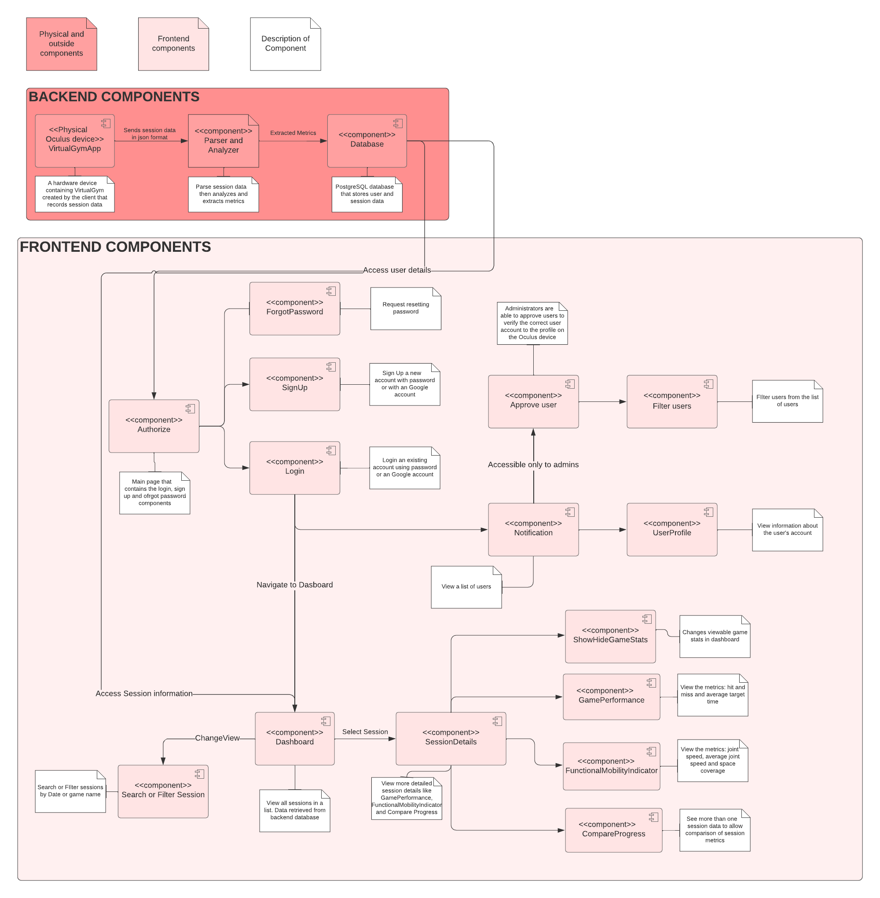

# Software Design

This page includes a short description of the overall architecture style of the system, its high-level system components, and their logical (what data they exchange) and control (how they invoke each other) dependencies.

## Low-Fidelity User Interface
The interface is a wireframe which includes the basic components of what the application may look like. It includes the main homepage as the virtual dashboard that displays a list of sessions. After selecting a session, it navigates to the Detailed Session Page which displays the session statistics.

[](files/dashboard_wireframe.png)

## UI Dataflow Diagram
This diagram shows the basic flow of data through our application from a user perspective.
[](files/UI_Dataflow.png)

## Architecture/Component Diagram

This is a visual representation of the initial software architecture of our system. The physical oculus device hosts the Virtual Gym Exergame app created by the clients. After a user is finished a game session, a session log is generated and will be sent by the client to a parser and analyzer component that is part of our system. This component will read and extract metrics that will be sent to our system's database. The metrics are displayed visually on a website using the frontend components

[](files/Virtual_Gym_Component_Diagram.png)

## UML Deployment Diagram

This is a visual representation of what the deployment of our system will look like.

[](files/Virtual_Gym_deployment_diagram-Higher_level_UML_deployment_diagram.png)

## Class Diagram
This class diagram that includes a component for User and for session. This will be the main building block of our object-oriented system.
[](files/UML_class.png)

## Sequence Diagram

The sequence diagram describes the core dynamic behaviors of the system.

[](files/sequence_diagram.png)

## Database Schema
Our current database is PostgreSQL that was implemented using Django Models.
```
Session:
  id: String Primary key,
  user: String Foreign key RELATES TO User, 
  deviceId: String,
  hits: Int,
  misses: Int,
  avgHitSpeed: Double,
  startTime: Date,
  endTime: Date,
  version: String,
  gameType: String,
  targetHitSpeedList: Json,
  leftArmSpeedList: Json,
  rightArmSpeedList: Json,
  headSpeedList: Json
  leftArmAvgSpeed: Float,
  rightArmAvgSpeed: Float,
  headAvgSpeed: Float,
  leftArmSpaceCoverage: Json,
  rightArmSpaceCoverage: Json,

User:
  id: String Primary key,
  firstName: String,
  lastName: String,
  email: String,
  password: String,
  role: String,
  username: String,
  approved: Boolean,
```
## API Specifications
### Get User By ID
``
GET users/<str:user_id>/
`` - Get account information for the given UserID
```python
response = {
            "id": 1,
            "firstName": "John",
            "lastName": "Doe",
            "email": "johndoe@ualberta.ca"
            "password": "$2b$12$jtGaxsXz4ayNpo19YklZsuqrryo3iczMOdurkQcI00e6ldbhW//wO",
            "role": "admin"
           }
```
### Get Session By ID
``
GET sessions/<str:session_id>/
`` - Get session information for the given SessionID
```python
response = {
                "id": 39,
                "userFirstName": "Anthony",
                "userLastName": "Ma",
                "user": "VikSkywalker",
                "deviceId": "34c482c75fd578edcd435c91b1977698",
                "hits": 34,
                "misses": 2,
                "avgHitSpeed": 3.0512941176470614,
                "startTime": "2022-03-23T11:55:53-06:00",
                "endTime": "2022-03-23T11:58:43-06:00",
                "version": "3.0",
                "gameType": "bubbles",
                "targetHitSpeedList": [
                    {
                        "target": "TargetLeft0",
                        "timeUntilHit": 2.5039999999999907
                    },
                    {
                        "target": "TargetRight0",
                        "timeUntilHit": 2.5360000000000014
                    }],
                  "leftArmSpeedList": {
                        "242.0": 27.27124049057967,
                        "267.2": 1.4494198135124554
                   },
                   "rightArmSpeedList": {
                        "242.0": 33.26522434291716,
                        "267.2": 1.6921792804423021
                   },
                   "headSpeedList": {
                        "242.0": 7.1287462278941645,
                        "267.2": 2.011699963634746
                   },
                   "leftArmAvgSpeed": 23.15649306852899,
                    "rightArmAvgSpeed": 24.620304710010195,
                    "headAvgSpeed": 13.528949306460802,
                    "leftArmSpaceCoverage": {
                        "35": 8,
                        "40": 13
                   },
                   "rightArmSpaceCoverage": {
                        "45": 13,
                        "50": 457
                   }
            }
                   
```
### Get List of Users
``
GET users/
`` - Gets list of account information for all of users
```python
response = [
    {
        "id": 6,
        "firstName": "1234",
        "lastName": "1234",
        "email": "12345@hotmail.com",
        "password": "1234",
        "role": "user"
    },
    {
        "id": 2,
        "firstName": "Basil",
        "lastName": "Lee",
        "email": "1234@hotmail.com",
        "password": "$2b$12$LU7rPG4Ew1G2pIbFOnBnoutMBpniTds0FWpQxRnsCu.lHYygjkP4C",
        "role": "user"
    }]
```
### Get List of Sessions
``
GET sessions/
`` - Gets list of session information for all of sessions
```python
response = [
    {
                "id": 39,
                "userFirstName": "Anthony",
                "userLastName": "Ma",
                "user": "VikSkywalker",
                "deviceId": "34c482c75fd578edcd435c91b1977698",
                "hits": 34,
                "misses": 2,
                "avgHitSpeed": 3.0512941176470614,
                "startTime": "2022-03-23T11:55:53-06:00",
                "endTime": "2022-03-23T11:58:43-06:00",
                "version": "3.0",
                "gameType": "bubbles",
                "targetHitSpeedList": [
                    {
                        "target": "TargetLeft0",
                        "timeUntilHit": 2.5039999999999907
                    },
                    {
                        "target": "TargetRight0",
                        "timeUntilHit": 2.5360000000000014
                    }],
                  "leftArmSpeedList": {
                        "242.0": 27.27124049057967,
                        "267.2": 1.4494198135124554
                   },
                   "rightArmSpeedList": {
                        "242.0": 33.26522434291716,
                        "267.2": 1.6921792804423021
                   },
                   "headSpeedList": {
                        "242.0": 7.1287462278941645,
                        "267.2": 2.011699963634746
                   },
                   "leftArmAvgSpeed": 23.15649306852899,
                    "rightArmAvgSpeed": 24.620304710010195,
                    "headAvgSpeed": 13.528949306460802,
                    "leftArmSpaceCoverage": {
                        "35": 8,
                        "40": 13
                   },
                   "rightArmSpaceCoverage": {
                        "45": 13,
                        "50": 457
                   }
            },
            {
                "id": 39,
                "userFirstName": "Anthony",
                "userLastName": "Ma",
                "user": "VikSkywalker",
                "deviceId": "34c482c75fd578edcd435c91b1977698",
                "hits": 34,
                "misses": 2,
                "avgHitSpeed": 3.0512941176470614,
                "startTime": "2022-03-23T11:55:53-06:00",
                "endTime": "2022-03-23T11:58:43-06:00",
                "version": "3.0",
                "gameType": "bubbles",
                "targetHitSpeedList": [
                    {
                        "target": "TargetLeft0",
                        "timeUntilHit": 2.5039999999999907
                    },
                    {
                        "target": "TargetRight0",
                        "timeUntilHit": 2.5360000000000014
                    }],
                  "leftArmSpeedList": {
                        "242.0": 27.27124049057967,
                        "267.2": 1.4494198135124554
                   },
                   "rightArmSpeedList": {
                        "242.0": 33.26522434291716,
                        "267.2": 1.6921792804423021
                   },
                   "headSpeedList": {
                        "242.0": 7.1287462278941645,
                        "267.2": 2.011699963634746
                   },
                   "leftArmAvgSpeed": 23.15649306852899,
                    "rightArmAvgSpeed": 24.620304710010195,
                    "headAvgSpeed": 13.528949306460802,
                    "leftArmSpaceCoverage": {
                        "35": 8,
                        "40": 13
                   },
                   "rightArmSpaceCoverage": {
                        "45": 13,
                        "50": 457
                   }
            }
          
]
```
### Post Signed Up User
``
POST signup/google/
`` - Request for the token of Google account for our system to sign up
```python
response = {
            "id": 1,
            "token": "1a2df23fsdf324gslkjsdlgkjgenoip",
            "firstName": "John",
            "lastName": "Doe"
           }
```
### Post Logged In User
``
POST login/google/
`` - Request for the token of Google account for our system to log in
```python
response = {
            "token": "1a2df23fsdf324gslkjsdlgkjgenoip",
            "email": "john@gmail.com"
           }
``
### Swagger API Schema
`` - Direation to auto-generated API documentation.
GET docs/
```
```
html of API schema
```
