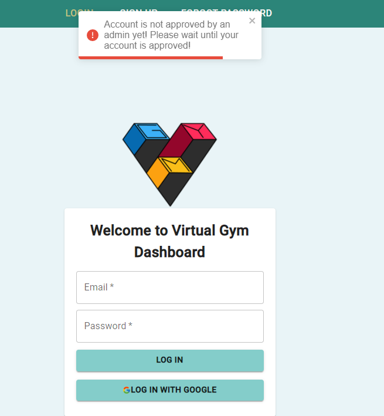
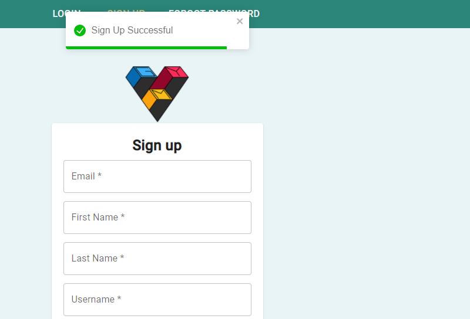
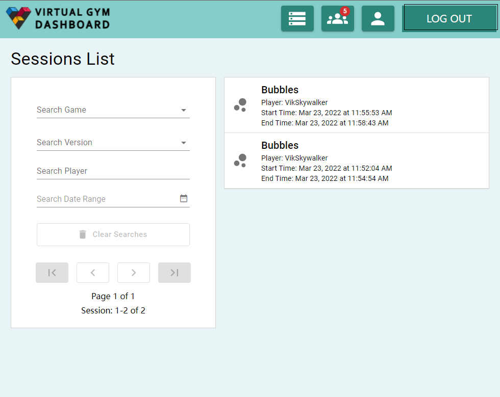

# Test Documentation

## US 1.0.1 - Web Access/Deployment:

1. We can access the application from a web browser by typing in the url of our deployed project. 

## US 2.0.1 - Login:

1. The user selects the login tab.

2. The user provides their google account credentials 

3A. If the user's provided credentials are not recognized, they will recieve a error message informing the user that the account does not exist.

3F. If the user's provided credentials are recognized but the admin hasn't approve the user, they will receive an error message inform the user that account not been approved.

3B. If the user's provided credentials are recognized, they will be be successfully logged in and redirected to the dashboard page.

## US 2.0.2 - Sign up

1. The user selects the sign up tab.

2. The user provides their google account credentials 

3. A prompt ask the user to provide a username

4A. If the user's provided credentials are already in the system, they will recieve a error message informing the user that the account already exists

4S. If the user's provided credentials are valid, they will be informed that their sign up process was successful

## US 2.0.4 - Logout

1. The user selects the logout button from the main dashboard

2. The user is redirected back to the login page

## US 3.0.1 - Progress Dashboard

1. From the main dashboard page, the user is able to see a list of completed sessions, and for each session, the player can see the player name, and start/end timestamps.

2. Clicking on a session list item from the dashboard takes the user to that session's session detail list, which displays a variety of data visualizations that the user can see. 

## US 3.0.2 - View Time Spent on Game or Session

1. From the main dashboard page, the user is able to see the start/end timestamps for each session item.

2. When the user clicks on a session item, they are able to see the total time spent, and the start/end timestamps from the session details page.

## US 3.0.3 - Compare Progress

1. Inside session details page, users are able to navigate to *compare progress* tab, where users can compare their game session data between the previous average, so that users can see how well  they performed over a period of time

## US 3.0.4 - Filter/search Game Sessions

1. The user can search the sessions using one aspect of the session, such as which *date range* does it fall into.

2. The user can search for the sessions using a combination of multiple aspects of the sessions, including *choose game name*, *choose game version*, *search player by username that contains....*, *pick date range*.

3. When user click *Clear Searches*, all the filters will be removed and the full sessions list will show up.

4. When there is no result giving search criteria, an error page will show up to inform the user.

## US 4.0.1 - Game Performance

1. The user can see the hits/misses, and average target time from the session details page, *game performance* tab

## US 4.0.2 - View Hits and Misses

1. The user can see the hits and misses in a pie chart from the session details page.

## US 4.0.3 - Average target time

1. The user can see the average target time from the session details page with a bar graph showing details.

## US 5.0.1 - Functional Mobility Indicators

1. The user can see individual joint speed at a specific point in time, along with average data.

	
	1.z. The user can using mouse scroller to zoom-in/out to change the time range

2. The user can see space coverage for each arm with a visual representation on the same page.

3. The user can export the graph to pictures or other printable formats or print directly.

## US 6.0.1 - Show/Hide Statistics

1. The user can hide statistics they would like to hide
    
2. The user can add the statistic back. 

## US 7.0.1 - View User Profile

1. Users can access their user settings by selecting a button from anywhere on our system other than the login and sign up pages

2. Users should be able to view their own user profile information such as first name, last name and email

## US 7.0.2 - Change user password

1. User should be able to change their password from their user settings

2. After change successfully, user can see a notification for password changed successfully

## Automated unit tests

### Backend:

The automated unit tests from the Django backend can be found in server/virtualgym/server/tests, test_models.py contains tests the database models, test_rest_api.py contains tests of the backend REST endpoints. The tests can be run from the django project root with ``python3 manage.py test``.

 

### Frontend: 
The unit tests for React frontend can be found int client/src/components. Test directories can be found under the Dashboard and Session folder. Under Dashboard/__test__, Session.test.js test whether the game name, player name, start time and end time are rendered. Under Session/__test__, SessionDetails.test.js contains tests that check the correct rendering of text as well as the tab functionality of navigating between game performance, functional mobility and compare session pages. The tests can be run from inside the client directory with ``npm test``

